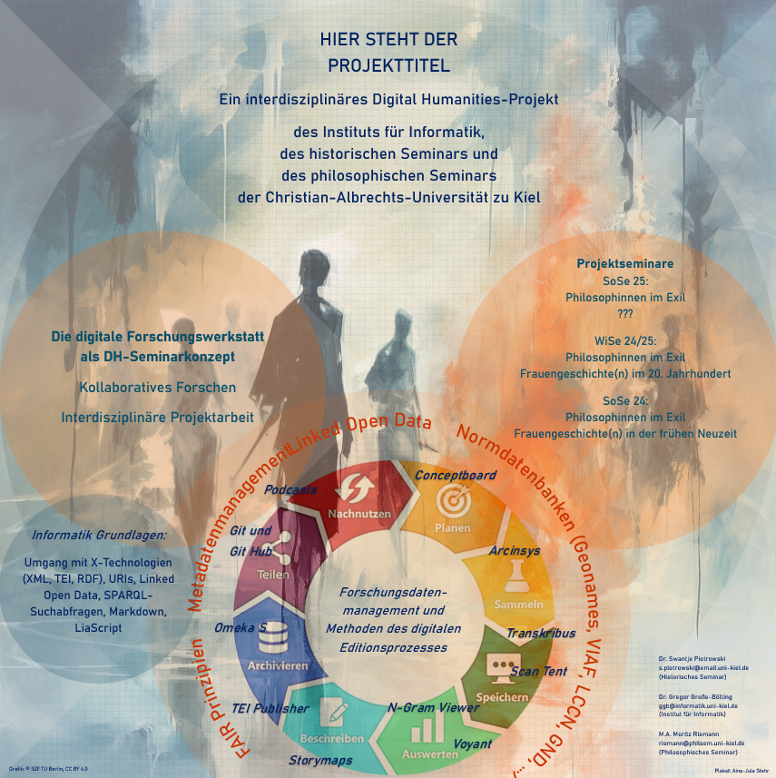

<!--
author:   Aina-Jula Stehr

email:    stu223341@mail.uni-kiel.de

version:  0.0.1

language: en

narrator: US English Female

-->

# Projekttitel



# Projektidee

Hier Text aus Projektantrag?

Die digitale Forschungswerkstatt als DH-Seminarkonzept
Kollaboratives Forschen 
Interdisziplinäre Projektarbeit

# Forschungsdatenmanagement
## Was sind Daten in den digitalen Geisteswissenschaften?

In den digitalen Geisteswissenschaften (Digital Humanities) bezieht sich der Begriff "Daten" auf die digitalen Informationen, die als Grundlage für die Forschung, Analyse und Visualisierung genutzt werden. 
Diese Daten können aus einer Vielzahl von Quellen und Formaten stammen und haben oft einen starken Bezug zu den traditionellen Geisteswissenschaften wie Literatur, Geschichte, Kunst, Linguistik und Philosophie. 
Die digitalen Geisteswissenschaften nutzen diese Daten, um neue Fragestellungen zu beantworten oder klassische Themen mit modernen digitalen Methoden zu untersuchen. Ziel ist es, geisteswissenschaftliche Erkenntnisse mit Hilfe von computergestützten Analysen zu erweitern, z. B. durch:

- Erkennung von Mustern in großen Textkorpora.
- Rekonstruktion historischer Netzwerke oder Entwicklungen.
- Untersuchung von kulturellen Phänomenen durch Datenvisualisierung.

Daten in diesem Kontext umfassen:

1. Primärdaten
- Texte: Digitalisierte Bücher, Manuskripte, Briefe, Zeitungsartikel, Theaterstücke und Gedichte, häufig in Form von Plain Text, XML (z. B. TEI-XML) oder anderen Formaten
- Bilder: Digitale Reproduktionen von Gemälden, Fotografien, Karten oder archäologischen Artefakten
- Audio- und Videodaten: Aufnahmen von Musik, Interviews, Reden oder Filmen
- Datenbanken: Historische, linguistische oder kulturelle Datenbanken (z. B. Stammbäume, Kataloge)

2. Metadaten
Metadaten sind Informationen, die die Primärdaten beschreiben oder strukturieren, z. B.:

- Titel, Autor, Veröffentlichungsdatum und -ort eines Buches
- Geographische Koordinaten von historischen Karten
Kontextinformationen wie Entstehungszeit, Stil oder Genre

3. Quantitative Daten
- Statistische Erhebungen und numerische Daten, etwa zur Bevölkerungsentwicklung, ökonomischen Trends oder Klimadaten
- Netzwerkanalysen (z. B. soziale Netzwerke zwischen historischen Figuren oder literarischen Charakteren)

4. Geodaten
Daten mit räumlichen Informationen, wie etwa GIS-Daten (Geoinformationssysteme) zur Kartierung historischer Orte und Ereignisse

5. Digitale Annotationen
Anmerkungen zu Texten oder Bildern, etwa linguistische Analysen (z. B. grammatische oder semantische Markierungen) oder kulturelle Kontexte

6. Maschinell generierte Daten
Ergebnisse von Text-Mining, Sentiment-Analysen, Topic Modeling oder Natural Language Processing (NLP), bei denen Algorithmen verwendet werden, um aus Texten oder Bildern neue Daten abzuleiten.

## Linked Open Data

Linked Open Data (LOD) ist ein Konzept und eine Technologie, die darauf abzielt, Daten so zu veröffentlichen, dass sie im Internet miteinander verknüpft, maschinenlesbar und offen zugänglich sind. Es basiert auf den Prinzipien des Semantischen Webs und fördert die Nutzung von standardisierten Technologien, um die Interoperabilität von Daten über verschiedene Domänen hinweg zu ermöglichen.

**Vorteile von Linked Open Data**

- Interoperabilität: Unterschiedliche Datenquellen können integriert und gemeinsam genutzt werden. Zum Beispiel Historische Daten aus Archiven, die mit Daten aus Bibliotheken und Museen verknüpft werden, um ein umfassendes Bild von Ereignissen oder Personen zu schaffen.
- Maschinenlesbarkeit: Daten können von Algorithmen verarbeitet und analysiert werden, was Automatisierung und neue Forschung ermöglicht.
- Wissenserweiterung durch Verknüpfungen: Verlinkungen erlauben es, Beziehungen und Muster zwischen Daten sichtbar zu machen, die vorher unzugänglich waren.
- Offenheit und Nachnutzung: Durch offene Lizenzen können Daten frei genutzt, kombiniert und für neue Anwendungen aufbereitet werden.

**Kernprinzipien von Linked Open Data** (nach Tim Berners-Lee)

- Verwendung von URIs: Jede Ressource (z. B. ein Objekt, Konzept oder eine Person) erhält eine eindeutige Adresse im Web (Uniform Resource Identifier), damit sie identifiziert werden kann.
- HTTP-URIs: Die URIs sollten über das HTTP-Protokoll zugänglich sein, sodass sie leicht aufgerufen und genutzt werden können.
- Bereitstellung von maschinenlesbaren Daten: Die Informationen zu den Ressourcen sollen in standardisierten Formaten bereitgestellt werden, etwa RDF (Resource Description Framework) oder JSON-LD (JSON for Linked Data).
- Verknüpfung von Ressourcen: Daten sollten mit anderen Datenquellen verlinkt sein, um ein Netz von Informationen zu schaffen, das von Maschinen durchsucht und analysiert werden kann.
- Offenheit der Daten: Die Daten sollen frei zugänglich sein (unter einer offenen Lizenz wie CC BY), damit sie ohne Einschränkungen genutzt werden können.

**Wie funktioniert Linked Open Data?**

- Datenmodellierung mit RDF: Daten werden als "Triple" dargestellt: Subjekt - Prädikat - Objekt.

    Beispiel:
    ```html
    <http://dbpedia.org/resource/Berlin> <http://xmlns.com/foaf/0.1/name> "Berlin".
    ```
    Hier wird beschrieben, dass die Ressource "Berlin" einen Namen hat, der ebenfalls "Berlin" lautet.

- Ontologien und Vokabulare: Um Daten besser zu strukturieren und zu standardisieren, verwendet LOD Ontologien (z. B. FOAF, Dublin Core). Diese definieren, wie Konzepte und ihre Beziehungen beschrieben werden.
- Verlinkung mit anderen Datenquellen: Die Daten sind nicht isoliert, sondern mit anderen Datensätzen verknüpft, etwa zwischen DBpedia, Wikidata und spezialisierten Datenbanken (z. B. Europeana für kulturelles Erbe).


Beispiele für LOD Wissensdatenbanken:

- DBpedia: Eine strukturierte Datenbank, die Informationen aus Wikipedia extrahiert und miteinander verknüpft. Sie ermöglicht Anfragen in maschinenlesbarer Form.
- Wikidata: Eine zentrale Wissensdatenbank, die strukturierte und verknüpfte Daten über verschiedene Themen bereitstellt.
- Europeana: Eine digitale Plattform für das kulturelle Erbe Europas, die Linked Open Data nutzt, um Museen, Bibliotheken und Archive miteinander zu verbinden.
- Library of Congress: Verwendet Linked Open Data, um ihre Kataloge für maschinenlesbare Anfragen bereitzustellen

## Normdatenbanken 


## Digitale Editionen

[LiaScript Kurs Digitale Editionswissenschaft](https://github.com/DH-Lehre/2023SoSe_Digitale-Editionswissenschaft)

## Metadatenmanagement 
- Deskriptive Metadaten
- Strukturelle Metadaten
- Administrative Metadaten
- Technische Metadaten

Metadatenstandards

Creative Commons Lizenzen

## FAIR-Prinzipien
## Forschungszyklus 

# Methoden und Tools der digitalen Projektarbeit

## Planen 

[Checkliste Planung](https://www.static.tu.berlin/fileadmin/www/40000027/Dokumente/Checkliste_Planung_2023.pdf) der TU-Berlin

### Conceptboard

## Sammeln 

Wo und wie recherchieren?

Beispiele für Datensammlungen:
- Die Deutsche Digitale Bibliothek (DDB)
- Das Archivportal-D 
- Das Zentrale Verzeichnis Digitalisierter Drucke (zvdd)
- Der Worldcat
- Hathi Trust Digital Library
- TextGrid repository 
- Generische Suche/DARIAH-DE 
- Bielefeld Academic Search Engine (BASE)
- Deutsches Textarchiv (DTA)
- Prometheus (Bildarchiv)

### Umgang mit X-Technologien
XML, TEI, RDF

[LiaScript Kurs zum Umgang mit X-Technologien](in progress)

### SPARQL-Suchabfragen

### Arcinsys

[LiaScript Kurs zur Einführung in die Arbeit mit Arcinsys](https://github.com/DH-Lehre/arcinsys-workflow)

## Speichern 

[Checkliste Speicherung](https://www.static.tu.berlin/fileadmin/www/40000027/Dokumente/Checkliste_Speicherung_2023.pdf) der TU-Berlin

Textdigitalisierung

### Scan Tent und Transkribus

[LiaScript Kurs zur Einführung in die Arbeit mit Transkribus](https://github.com/DH-Lehre/transkribus-workflow)

## Auswerten 
### Named Entity Recognition (Stanford-NER)?
### N-Gram Viewer
### Voyant

Distant Reading als Methode

[Voyant als "Distant Reading"-Tool](https://github.com/DH-Lehre/WiSe2023_Seminar-Heinrich-Bluechers-Nachlass/blob/main/main.md)

### Netzwerkanalyse mit Gephi?

## Beschreiben

[Checkliste Beschreibung](https://www.static.tu.berlin/fileadmin/www/40000027/Dokumente/Checkliste_Beschreibung_2023.pdf) der TU-Berlin

### Textvisualisierung mit Storymaps 

Verschiedene Visualisierungsmöglichkeiten

### Kollaborative Annotation mit CATMA?

### TEI Publisher

Deep Reading als Methode
Digitale Annotation

[TEI Publisher als "Deep Reading"-Tool](https://github.com/DH-Lehre/WiSe2023_Seminar-Heinrich-Bluechers-Nachlass/blob/main/main.md)

## Archivieren 

[Checkliste Archivierung](https://www.static.tu.berlin/fileadmin/www/40000027/Dokumente/Checkliste_Archivierung_2023.pdf) der TU-Berlin 

### Omeka S

[LiaScript Kurs zur Einführung in die Arbeit mit OmekaS](https://github.com/DH-Lehre/Omeka-S-Workflow)

## Teilen 

[Checkliste Veröffentlichung](https://www.static.tu.berlin/fileadmin/www/40000027/Dokumente/Checkliste_Veroeffentlichung_2023.pdf) der TU-Berlin 

### Git und Git Hub

## Nachnutzen 

[Checkliste Nachnutzung](https://www.static.tu.berlin/fileadmin/www/40000027/Dokumente/Checkliste_Nachnutzug_2023.pdf) der TU-Berlin 

### LiaScript

[LiaScript workflow](https://github.com/DH-Lehre/liascript-workflow/blob/vorl%C3%A4ufige-%C3%84nderungen-branch/workshop.md)

### Podcasts 

[LiaScript Kurs Podcast-Leitfaden](https://github.com/DH-Lehre/Podcast-Leitfaden)

# Projektseminare

Überblick

## Frauengeschichte(n) 

### SoSe 25: Frauengeschichte(n) ...

[LiaScript Kurs Frauengeschichte(n) ...](link folgt)

### WiSe 24/25: Frauengeschichte(n) im 20. Jahrhundert

[LiaScript Kurs Frauengeschichte(n) im 20. Jahrhundert](https://github.com/DH-Lehre/2024WiSe_Exil-Wissenschaftlerinnen)

### SoSe 24: Frauengeschichte(n) in der frühen Neuzeit

[LiaScript Kurs Frauengeschichte(n) in der frühen Neuzeit](https://github.com/DH-Lehre/2024SoSe_Seminar-Frauengeschichte-Fruehe-Neuzeit)

## Philosophinnen im Exil
Übersicht

### Seminar SoSe 25

[LiaScript Kurs Philosophinnen im Exil SoSe 25](link folgt)

### Seminar WiSe 24/25

[LiaScript Kurs Philosophinnen im Exil WiSe 24/25](https://github.com/DH-Lehre/2024WiSe_Exil-Philosophinnen_II)

### Seminar SoSe 24

[LiaScript Kurs Philosophinnen im Exil SoSe 24](https://github.com/DH-Lehre/2024SoSe_Seminar-Philosophinnen-im-Exil)