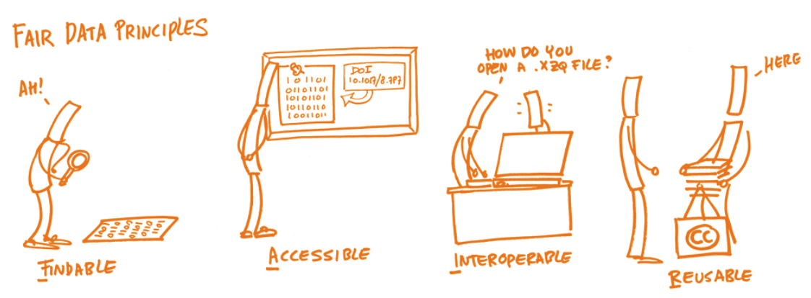

<!--
author:   Aina-Jula Stehr

email:    stu223341@mail.uni-kiel.de

version:  0.0.1

language: en

narrator: US English Female

-->

# Projekttitel

Moin. :-) Dieser Kurs dient als überblickgebende Führung durch die Forschungsmethoden, -tools und -ergebnisse eines interdisziplinären DH-Lehrprojekts der CAU Kiel, welches in Form von interaktiven digitalen Forschungswerkstätten umgesetzt wird. 


> **HINWEIS**: Die Links zu einzelnen Kursen leiten Sie jeweils zu dem entsprechenden GitHub Repository weiter. Um sich den Kurs formatiert in LiaScript anzeigen zu lassen, kopieren Sie die Markdown-URL [hier](https://liascript.github.io/) in das vorgesehene Feld.

# Projektidee

Die begrenzte Verfügbarkeit von Quellen, bestehende Geschlechterstereotype, Vorurteile und fehlende "Role Models" sind nur einige der Herausforderungen, denen sich die Frauen- und Geschlechtergeschichte seit jeher stellen muss. In der Philosophie gibt es wiederum wenig(er) Aufmerksamkeit für Autorinnen:
Nach wie vor prägen Texte von Männern die Wahrnehmung des Faches, obwohl Frauen seit der Öffnung der Universitaten Anfang des 20. Jahrhunderts am akademischen Diskurs teilnehmen konnten und ein großer Textkorpus von Philosophinnen vorliegt. Auch digitale Medien beeinflussen die Art und Weise, wie wir Geschichte erzählen, erleben, verbreiten und erarbeiten. Digitale Plattformen, Blogs, Foren und Social-Media-Kampagnen können ein neues Bewusstsein für geschlechtsspezifische Perspektiven schaffen und dazu beitragen, Veränderungen von Geschlechterrollen wahrzunehmen oder anzustoßen.

Studierenden wird mittels dieses Lehrprojekts die Möglichkeit geboten, sich forschungs- und quellenorientiert selbst ein Bild zu machen: 
Im Format von pro Semester je zwei Forschungswerkstätten wird dazu systematisch an Frauenbiographien und dem Werk von Frauen gearbeitet. 
Dabei kommen Methoden der Digital Humanities zum Einsatz, auch mit dem Ziel die Biographien einer größeren Öffentlichkeit zugänglich zu machen. Studierende erlernen so nicht nur wichtige Kompetenzen in der Arbeit mit Quellen und der Aufbereitung von Daten, sondern auch der Publikation und Wissenschaftskommunikation.

 Die in der Geschichte angesiedelten Projektseminare widmen sich verschiedenen Frauenbiografien der Frühen Neuzeit (SoSe 2025) und des 20. Jahrhunderts (WiSe 24/25 und SoSe 25). 
Denn auch noch in der Zeitgeschichte bleiben die Biografien vieler Frauen, bspw. von Wissenschaftlerinnen, vergleichsweise unsichtbar. Verantwortlich dafür war und ist die mangelnde Teilhabe vor Frauen an Wissenschaft und der wissenschaftlichen Geschichtsschreibung im Laufe des 19. Jahrhunderts, da ihnen schlichtweg der Zugang zu den Universitäten verwehrt blieb. Dies hatte zur Folge, dass die Themen von männlichen Handlungsräumen und Imaginationen beeinflusst wurden. 
Die Studieren gewinnen im Rahmen der Veranstaltungen einen Überblick über marginalisierte (d.h. im akademischen Diskurs weitestgehend unberücksichtigte) Forscherinnen. Es werden die wenigen Spuren in den Blick genommen, die trotzdem von Frauen hinterlassen wurden: Im Universitats- und Landesarchiv in Schleswig befinden sich Quellen, die bislang in Hinblick auf Frauen- und Geschlechterforschung noch nicht ausgewertet wurden.

 Die Seminare, die in der Philosophie angeboten werden, nehmen das Leben und Werk von Philosophinnen in den Blick, die aus Nazi-Deutschland fliehen mussten, und widmen sich dabei insbesondere dem Werk einer Auswahl von exilierten Philosophinnen, die bisher im akademischen Diskurs wenig Berücksichtigung gefunden haben. Hier ein Beitrag dazu, wie Frauen das Schicksalsjahr 1939 durchlitten: https://www.morgenpost.de/kultur/article236611641/Wie-Frauen-das-Schicksalsjahr-1939-durchlitten.ht.


In den beiden forschungsorientierten Lehrveranstaltungen sammeln, strukturieren, interpretieren und veröffentlichen Studierende Informationen über Frauen, um Einblicke in soziale, familiäre und wissenschafliche Netzwerke von Frauen im 20. Jahrhundert zu erhalten. Umgesetzt werden die Lehrveranstaltungen im Format einer **digitalen Forschungswerkstatt**: 
Der Arbeitsablauf wird Schritt für Schritt entwickelt, umgesetzt und diskutiert. Durch die Forschungspraxis werden Studierende mit digitalen Kenntnissen gängigen Methoden für die (digitale) Bearbeitung und Auswertung von bspw. handschriftichen Quellen vertraut gemacht. Die Lehrveranstaltungen bilden so eine solide Grundlage für die kritische Anwendung solcher Verfahren im weiteren Studium, wie bspw. in Abschlussarbeiten, und in wissensvermittelnden Berufsfeldern. 

Die enge Kooperation zwischen Geschichte, Philosophie und Informatik, die in diesem Projekt angestrebt wird, soll u.a fachübergreifend nutzbare Lehrmaterialien und Open Educational Ressources hervorbringen. Ein Eindruck von einem Teil der bisherigen Ergebnisse kann in den Abschnitten zu den Projektseminaren gewonnen werden. 
Durch das gemeinsame Lehrprojekt und den engen Austausch wird außerdem angestrebt, den Studierenden Einblick in die Praxis interdisziplinärer, kollaborative Forschungsprojekte zu geben.


# Forschungsdatenmanagement

 Forschungsdatenmanagement (FDM) dient dazu, Forschungsdaten systematisch zu organisieren, zu speichern, zu dokumentieren und langfristig zugänglich zu machen. Es spielt eine entscheidende Rolle für die Qualität, Reproduzierbarkeit und Nachnutzung wissenschaftlicher Arbeiten.

>Die digitale Forschungsprozess in unseren Seminaren orientiert sich entsprechend an dem Zyklus für Forschungsdaten.
>Der **Forschungsdatenzyklus** beschreibt den Lebenszyklus von Forschungsdaten von der Planung bis zur Nachnutzung. Die TU Berlin definiert diesen Zyklus in mehreren Phasen, die auch für das Forschungsdatenmanagement (FDM) in den Digital Humanities (DH) besonders relevant sind.


| **Phase**         | **Bedeutung für das FDM in den Digital Humanities (DH)** |
|------------------|--------------------------------------------------|
| **Planen**       | - Definition von Forschungsfragen und Datenmanagementstrategien <br> - Wahl geeigneter Standards (z. B. TEI für Texte) <br> - Klärung rechtlicher Fragen (Urheberrecht, Lizenzierung) |
| **Sammeln**      | - Suche nach und Bestellen von Archivalien <br> - Datenbanken gezielt durchsuchen <br> - Standardisierte Metadatenerfassung |
| **Speichern**    | - Digitale Erfassung und Speicherung von Texten, Bildern oder Audio <br> - Nutzung von optischer Zeichenerkennung (OCR), Digitalisierungs- und Erhebungstools <br> - Auswahl geeigneter Speicherorte und Dateiformate <br> - Nutzung institutioneller Repositorien oder Cloud-Lösungen <br> - Sicherstellung von Backup-Strategien und Datenintegrität |
| **Auswerten**    | - Anwendung digitaler Methoden wie Topic Modeling, Netzwerkanalyse, Sentiment Analysis <br> - Einsatz von Software wie Voyant Tools, Gephi oder Python <br> - Sicherstellung der Reproduzierbarkeit durch Dokumentation |
| **Beschreiben**  | - Annotieren <br> - Anreicherung der Daten mit strukturierten Metadaten <br> - Nutzung standardisierter Vokabulare und Ontologien <br> - Dokumentation der Datenherkunft und Verarbeitungsschritte |
| **Archivieren**  | - Speicherung in Langzeitarchiven <br> - Sicherstellung der langfristigen Lesbarkeit <br> - Vergabe von Persistent Identifiers (z. B. DOI) |
| **Teilen**       | - Veröffentlichung der Daten für die Forschungsgemeinschaft <br> - Lizenzierung zur Nachnutzung <br> - Bereitstellung über digitale Repositorien und Fachzeitschriften |
| **Nachnutzen**   | - Weiterentwicklung der Daten durch andere Forschende (z. B. digitale Editionen) <br> - Integration in andere DH-Projekte durch Linked Open Data <br> - Förderung von interdisziplinärer Zusammenarbeit und Open Science |

## Was sind Daten in den digitalen Geisteswissenschaften?

In den digitalen Geisteswissenschaften (Digital Humanities) bezieht sich der Begriff "Daten" auf die digitalen Informationen, die als Grundlage für die Forschung, Analyse und Visualisierung genutzt werden. 
In der Geschichte und Philosophie können diese Daten aus einer Vielzahl von Quellen und Formaten stammen und ermöglichen es, neue Fragestellungen zu beantworten oder klassische Themen mit modernen digitalen Methoden zu untersuchen. 

Daten in diesem Kontext umfassen:

1. **Primärdaten**
- Texte: Digitalisierte Bücher, Manuskripte, Briefe, Zeitungsartikel, Theaterstücke und Gedichte, häufig in Form von Plain Text, XML (z. B. TEI-XML) oder anderen Formaten
- Bilder: Digitale Reproduktionen von Gemälden, Fotografien, Karten oder archäologischen Artefakten
- Audio- und Videodaten: Aufnahmen von Musik, Interviews, Reden oder Filmen
- Datenbanken: Historische, linguistische oder kulturelle Datenbanken (z. B. Stammbäume, Kataloge)

2. **Metadaten**
Metadaten sind Informationen, die die Primärdaten beschreiben oder strukturieren, z. B.:

- Titel, Autor, Veröffentlichungsdatum und -ort eines Werkes
- Geographische Koordinaten
- Kontextinformationen wie Entstehungszeit, Stil oder Genre

3. **Quantitative Daten**
- Statistische Erhebungen und numerische Daten
- Netzwerkanalysen (z. B. soziale Netzwerke zwischen historischen Figuren oder literarischen Charakteren)

4. **Geodaten**
Daten mit räumlichen Informationen, wie etwa GIS-Daten (Geoinformationssysteme) zur Kartierung historischer Orte und Ereignisse

5. **Digitale Annotationen**
Anmerkungen zu Texten oder Bildern, etwa linguistische Analysen (z. B. grammatische oder semantische Markierungen) oder kulturelle Kontexte

6. **Maschinell generierte Daten**
Ergebnisse von Text-Mining, Sentiment-Analysen oder Topic Modeling, bei denen Algorithmen verwendet werden, um aus Texten oder Bildern neue Daten abzuleiten

## Linked Open Data


Linked Open Data (LOD) ist ein Konzept und eine Technologie, die darauf abzielt, Daten so zu veröffentlichen, dass sie im Internet miteinander **verknüpft**, **maschinenlesbar** und **offen zugänglich** sind. Es basiert auf den Prinzipien des Semantischen Webs und fördert die Nutzung von standardisierten Technologien, um die Interoperabilität von Daten über verschiedene Domänen hinweg zu ermöglichen.

**Vorteile von Linked Open Data**

- Interoperabilität: Unterschiedliche Datenquellen können integriert und gemeinsam genutzt werden. Zum Beispiel historische Daten aus Archiven, die mit Daten aus Bibliotheken und Museen verknüpft werden, um ein umfassendes Bild von Ereignissen oder Personen zu schaffen.
- Maschinenlesbarkeit: Daten können von Algorithmen verarbeitet und analysiert werden, was Automatisierung und neue Forschung ermöglicht.
- Wissenserweiterung durch Verknüpfungen: Verlinkungen erlauben es, Beziehungen und Muster zwischen Daten sichtbar zu machen, die vorher unzugänglich waren.
- Offenheit und Nachnutzung: Durch offene Lizenzen können Daten frei genutzt, kombiniert und für neue Anwendungen aufbereitet werden.

**Kernprinzipien von Linked Open Data** (nach Tim Berners-Lee)

- Verwendung von URIs: Jede Ressource (z. B. ein Objekt, Konzept oder eine Person) erhält eine eindeutige Adresse im Web (Uniform Resource Identifier), damit sie identifiziert werden kann.
- HTTP-URIs: Die URIs sollten über das HTTP-Protokoll zugänglich sein, sodass sie leicht aufgerufen und genutzt werden können.
- Bereitstellung von maschinenlesbaren Daten: Die Informationen zu den Ressourcen sollen in standardisierten Formaten bereitgestellt werden, etwa RDF (Resource Description Framework) oder JSON-LD (JSON for Linked Data).
- Verknüpfung von Ressourcen: Daten sollten mit anderen Datenquellen verlinkt sein, um ein Netz von Informationen zu schaffen, das von Maschinen durchsucht und analysiert werden kann.
- Offenheit der Daten: Die Daten sollen frei zugänglich sein (unter einer offenen Lizenz wie CC BY), damit sie ohne Einschränkungen genutzt werden können.

**Wie funktioniert Linked Open Data?**

- Datenmodellierung mit **RDF**: Daten werden als "Triple" dargestellt: Subjekt - Prädikat - Objekt.
- **Ontologien** und **Vokabulare**: Um Daten besser zu strukturieren und zu standardisieren, verwendet LOD Ontologien (z. B. FOAF, Dublin Core). Diese definieren, wie Konzepte und ihre Beziehungen beschrieben werden.
- **Verlinkung** mit anderen Datenquellen: Die Daten sind nicht isoliert, sondern mit anderen Datensätzen verknüpft.

**Beispiele für LOD Wissensdatenbanken:**

- DBpedia: Eine strukturierte Datenbank, die Informationen aus Wikipedia extrahiert und miteinander verknüpft. Sie ermöglicht Anfragen in maschinenlesbarer Form.
- Wikidata: Eine zentrale Wissensdatenbank, die strukturierte und verknüpfte Daten über verschiedene Themen bereitstellt.
- Europeana: Eine digitale Plattform für das kulturelle Erbe Europas, die Linked Open Data nutzt, um Museen, Bibliotheken und Archive miteinander zu verbinden.
- Library of Congress: Verwendet Linked Open Data, um ihre Kataloge für maschinenlesbare Anfragen bereitzustellen

### Das Wichtigste zu LOD - Ergebnisse aus Seminarsitzung

>Dies sind die Sitzungsergebnisse zu LOD aus dem Seminar zu Philosophinnen im Exil (SoSe 24):

**Was ist 'Linked Open Data'?**

Während das WWW ein Netz aus Webseiten ist, soll mit LOD ein Netz aus Daten entstehen, die aus verschiedenen Quellen zusammen automatisch weiterverwendet werden können.

**Allgemeines:**

LOD bedeutet, dass die Daten frei zugänglich und unter Lizenzen verfügbar sind, die ihre Nutzung und Weiterverarbeitung erlauben.

Ein zentrales Konzept von LOD ist die Eindeutigkeit: Jeder Eintrag, sei es eine Person, ein Ort oder ein Konzept, wird durch eine eindeutige Kennung, einen Uniform Resource Identifier (URI), identifiziert.

Ein Tripel, bestehend aus Subjekt, Prädikat und Objekt, bildet die grundlegende Struktur von Linked Data und beschreibt Aussagen über Ressourcen.

**Uniform Resource Identifier (URI):**

Die URI ist eine zuverlässige Methode zur eindeutigen Identifizierung einer Entität (einer Webseite, eines Objekts, einer Beziehung usw.) auf eine Weise, die von jedem genutzt werden kann.

Eine URL (Uniform Resource Locator) ist eine spezifische Art von URI, die nicht nur identifiziert, sondern auch den Ort und die Methode zum Abrufen der Ressource angibt.

Das DNS (Domain Name System) sorgt dafür, dass Domänennamen (z.B. www.example.com) weltweit eindeutig sind. Dies unterstützt die Eindeutigkeit von URIs, da eine URI oft einen Domänennamen enthält, der eindeutig von einer Organisation kontrolliert wird.

**Ontologien:**

Eine Ontologie ist ein formales Modell, das Konzepte und deren Beziehungen in einem bestimmten Bereich definiert. Sie bietet eine gemeinsame Struktur und Terminologie für die Beschreibung von Daten.

Taxonomien sind hierarchische Klassifikationen von Begriffen. Ontologien unterscheiden sich davon, da sie umfassendere Modelle sind, die sowohl Hierarchien als auch komplexere Beziehungen zwischen Begriffen darstellen.

**RDF und Datenformate:**

Serialisierung ist der Prozess, bei dem Datenstrukturen in ein speicher- oder übertragbares Format umgewandelt werden.

Turtle (Terse RDF Triple Language) ist ein kompaktes und lesbares Format zur Serialisierung von RDF-Daten. Es verwendet Präfixe, um lange URI-Referenzen abzukürzen und die Lesbarkeit zu verbessern.

**Warum 'Linked Data'?**

"Wenn alle Datensätze offen veröffentlicht würden und das gleiche Format zur Strukturierung der Informationen verwendeten, wäre es möglich, alle Datensätze gleichzeitig zu durchsuchen. Die Analyse riesiger Datenmengen ist potenziell viel leistungsfähiger, als wenn jeder seine eigenen individuellen Datensätze im Web nutzt, die als Informationssilos bekannt sind."

Dies wurde mit einem Beispielsgraphen veranschaulicht, einer aus DBpedia generierten Übersicht von Exilphiloph:innen.

## FAIR-Prinzipien

Die FAIR-Prinzipien (Findable, Accessible, Interoperable, Reusable) dienen als Leitprinzipien dafür, dass Daten langfristig und unabhängig zugänglich, nachnutzbar und nachprüfbar bleiben.
Der Hauptunterschied zwischen den LOD- und den FAIR-Prinzipien liegt in der Accessibility, da im Vergleich zu den Linked Open Daten nicht alle Forschungsergebnisse zur Verfügung gestellt werden. Forschungsdaten (FDM) sollten generell so offen wie möglich sein.
Während das Hauptziel der FAIR-Prinzipien in einer Erhöhung der Nachnutzbarkeit von Daten liegt, stellt der Fokus der LOD-Prinzipien die Zugänglichkeit der Daten dar.

>Ein entsprechendes LiaScript-Modul von Britta Petersen finden Sie [hier](https://liascript.github.io/course/?https://raw.githubusercontent.com/RDM4CAU/lehre/main/Philo_DH-Sem_2024/FDM.md#1).



## Digitale Editionen

 Der digitale Editionsprozess stellt einen wesentlichen Teil der Projektseminare dar. Anders, als es vielleicht die erste Intuition verrät, ist eine digitale Edition mehr als ein gescannter Text – sie nutzt digitale Technologien, um Texte umfassender darzustellen, interaktiv nutzbar zu machen und wissenschaftlich auszuwerten.

>Was eine Edition zu einer digitalen Edition macht, wurde im SoSe 2023 konkret in einem Kurs zur Digitalen Editionswissenschaft erarbeitet und in dem entsprechenden [LiaScript-Modul zur digitalen Editionswissenschaft](https://github.com/DH-Lehre/2023SoSe_Digitale-Editionswissenschaft) dokumentiert.

Literaturempfehlungen: 

- Baillot, Anne/Schnöpf, Markus: Von wissenschaftlichen Editionen als interoperablen Projekten, oder: Was können eigentlich digitale Editionen?, in: Digital Humanities. Praktiken der Digitalisierung, der Dissemination und der Selbstreflexivität, hrsg. von Wolfgang Schmale, Stuttgart 2015, S. 139-156.
- Sahle, P. 2016. 2. What is a Scholarly Digital Edition? In: Driscoll, M. J., & Pierazzo, E. (Eds.), Digital Scholarly Editing: Theories and Practices. Open Book Publishers. aus dem Werk: http://books.openedition.org/obp/3397

## Metadatenmanagement 

>Metadaten sind „Daten über Daten“ – sie liefern beschreibende, technische und administrative Informationen zu Forschungsdaten.

**Typische Metadatenkategorien sind:**

- Deskriptive Metadaten: Titel, Autor(en), Schlüsselwörter, Zusammenfassung
- Strukturelle Metadaten: Beziehungen zwischen Datensätzen oder Versionen
- Technische Metadaten: Dateiformat, Software, Sensor- oder Messparameter
- Administrative Metadaten: Lizenz, Zugriffsrechte, Urheberrecht, Aufbewahrungsfristen
- Provenienz-Metadaten: Entstehungsgeschichte, Datenverarbeitungsschritte, Versionierung

**Warum sind Metadaten für das FDM wichtig?**

- *Auffindbarkeit und Nachnutzbarkeit*: Metadaten machen Forschungsdaten auffindbar, z. B. durch Kataloge oder Suchmaschinen (FAIR-Prinzipien: Findable). Wissenschaftler:innen können durch standardisierte Metadaten relevante Datensätze leichter finden.
- *Kontext und Interpretierbarkeit*: Metadaten helfen, den Kontext der Daten zu verstehen: Wer hat die Daten erhoben? Wie wurden sie generiert? Welche Methoden wurden verwendet? Ohne Metadaten sind Daten oft unbrauchbar, da wichtige Informationen über ihre Entstehung fehlen.
- *Interoperabilität und Austauschbarkeit*: Standardisierte Metadatenformate ermöglichen den Datenabgleich zwischen Systemen, Institutionen und Disziplinen. Dies erleichtert die Zusammenarbeit und ermöglicht das automatisierte Verarbeiten von Daten.
- *Langfristige Archivierung und Reproduzierbarkeit*: Forschungsdaten müssen oft über Jahre oder Jahrzehnte aufbewahrt werden. Metadaten helfen, diese lesbar und interpretierbar zu halten, selbst wenn Technologien oder Formate sich ändern. Sie sind somit essenziell für die Reproduzierbarkeit wissenschaftlicher Ergebnisse.
- *Zitierfähigkeit und wissenschaftliche Anerkennung*: Mit Metadaten können Datensätze als eigenständige Forschungsleistung veröffentlicht und zitiert werden, z.B. als Digital Object Identifier (DOI). Wissenschaftler:innen erhalten dadurch Anerkennung für ihre Daten und können ihre Forschung besser nachweisen.

### Metadatenstandards

Metadatenstandards sind normierte Schemata zur strukturierten Beschreibung von Daten. Sie definieren, welche Metadatenfelder existieren, welche Informationen sie enthalten und in welchem Format sie gespeichert werden.

Zu den wichtigen Standards gehören:

| **Standard**         | **Einsatzgebiet** |
|----------------------|------------------|
| **Dublin Core (DC)** | Allgemeine Beschreibung von Dokumenten, Webseiten und digitalen Objekten |
| **DataCite Metadata Schema** | Standard für Forschungsdaten und DOI-Registrierung |
| **MODS (Metadata Object Description Schema)** | Bibliotheken, digitale Sammlungen |
| **METS (Metadata Encoding and Transmission Standard)** | Archivierung und Austausch komplexer digitaler Objekte |
| **EAD (Encoded Archival Description)** | Archive und Nachlässe |
| **ISO 19115** | Geodaten (GIS, Fernerkundung) |
| **CIDOC CRM** | Kulturelles Erbe, Museen |
| **TEI (Text Encoding Initiative)** | Digital Humanities, Texteditionen |
| **DCAT (Data Catalog Vocabulary)** | Open Data und Linked Open Data |
| **PREMIS (Preservation Metadata)** | Digitale Langzeitarchivierung |

### Normdatenbanken

Normdatenbanken sind strukturierte Sammlungen von standardisierten Informationen. Solche Normdaten bieten ein kontrolliertes Vokabular zur Identifikation von Personen, Orten, Institutionen u.v.m. In Normdatenbanken werden Normdaten anhand eines eindeutigen, persistenten Identifiers zur Verfügung gestellt. Dieser wird auch als Uniform Resource Identifier (URI) bezeichnet.

**Wichtige Normdatenbanken:**

- [Gemeinsame Normdatei (GND) der Deutschen Nationalbibliothek](https://www.dnb.de/DE/Professionell/Standardisierung/GND/gnd_node.html): Personen, Körperschaften, Orte
- [LCCN (Library of Congress Control Number)](https://www.loc.gov/programs/preassigned-control-number/about-this-program/): amerikanische Variante der GND
- [VIAF (Virtual International Authority File)](https://viaf.org/de): Mapping versch. Normdaten
- [Geonames](https://www.geonames.org/): offenes Projekt für Ortsnamen
- [TGN (Getty Thesaurus of Geographic Names)](https://www.getty.edu/research/tools/vocabularies/tgn/): Ortsnamen
- [Wikidata](https://www.wikidata.org/wiki/Wikidata:Main_Page): Eine offene, kollaborative Datenbank für strukturierte Daten

Eine entscheidende Rolle im digitalen Editionsprozess spielt das sogenannte **Linking** - die Verknüpfung von Daten zwischen verschiedenen Normdatenbanken oder zwischen identifizierten benannten Entitäten und einer ausführlichen Erklärung bzw. einem Normdatum.
Ein Beispiel hierfür findet sich [hier](https://liascript.github.io/course/?https://raw.githubusercontent.com/DH-Lehre/2023SoSe_Digitale-Editionswissenschaft/main/main.md#100).

**Nutzen von Normdaten und Linking:**

- *Eindeutige Identifikation*: Verhindert Verwechslungen (z. B. zwischen verschiedenen Personen mit gleichem Namen)
- *Interoperabilität*: Verschiedene Systeme und Datenbanken können Informationen leichter austauschen
- *Effizienz in der Recherche*: Nutzer:innen können verknüpfte Datenbanken durchsuchen, ohne mehrfach zu suchen
- *Automatische Datenverarbeitung*: Maschinen können Zusammenhänge besser erkennen und Informationen anreichern
- *Langfristige Archivierung*: Normdaten bieten eine stabile Referenz, auch wenn sich andere Metadaten ändern

>Vertiefende Informationen finden Sie hier: Kapitel 16 "Aufbau von Datensammlungen" (S. 223 - 233) in: Jannidis, F.; Kohle, H. & Rehbein, M. (Eds.): Digital Humanities. J.B. Metzler, 2017.


### Creative Commons Lizenzen

Lizenzen sind essenziell für offene Wissenschaft, Rechtssicherheit und Nachnutzbarkeit von Forschungsdaten. Forschende sollten frühzeitig eine geeignete Lizenz wählen, um Transparenz, Reproduzierbarkeit und Anerkennung zu fördern.

Für Beiträge zur LOD-Cloud und das Erstellen von Open Educational Resources (OER) eignen sich [Creative Commons (CC)](https://creativecommons.org/share-your-work/) besonders gut: Ein standardisiertes Lizenzsystem, das Urheber:innen ermöglicht, ihre Werke rechtssicher zu veröffentlichen und festzulegen, unter welchen Bedingungen sie genutzt werden dürfen.
CC-Lizenzen erleichtern die freie Verbreitung von Wissen, indem sie eine rechtlich klare Alternative zum "Alle Rechte vorbehalten"-Modell bieten.


| **Lizenz**           | **Bedingungen** | **Symbol** |
|----------------------|----------------|------------|
| **CC 0** *(Public Domain)* | Keine Rechte vorbehalten – uneingeschränkte Nutzung möglich |  |
| **CC BY** *(Namensnennung)* | Nutzung, Bearbeitung und Verbreitung erlaubt – unter Angabe der Urheberschaft |  |
| **CC BY-SA** *(Namensnennung – Weitergabe unter gleichen Bedingungen)* | Nutzung und Bearbeitung erlaubt, aber nur unter derselben Lizenz weiterverbreitbar |  |
| **CC BY-ND** *(Namensnennung – Keine Bearbeitung)* | Verbreitung erlaubt, aber keine Bearbeitung oder Veränderung |  |
| **CC BY-NC** *(Namensnennung – Nicht-kommerziell)* | Nutzung und Bearbeitung erlaubt, aber nicht für kommerzielle Zwecke |  |
| **CC BY-NC-SA** *(Namensnennung – Nicht-kommerziell – Weitergabe unter gleichen Bedingungen)* | Nicht-kommerzielle Nutzung und Bearbeitung erlaubt, aber nur mit gleicher Lizenz weitergebbar |  |
| **CC BY-NC-ND** *(Namensnennung – Nicht-kommerziell – Keine Bearbeitung)* | Verbreitung erlaubt, aber weder Bearbeitung noch kommerzielle Nutzung |  |

## Umgang mit X-Technologien

>Die Arbeit in dem interdisziplinären Feld der Digital Humanities setzt nicht notwendigerweise ein ganzes Informatikstudium voraus. Doch zumindest der Umgang mit Technologien zur strukturierten Datenverarbeitung stellt eine wesentliche Grundlage des digitalen Forschungsdatenmanagements und des Einsatzes von DH-Tools in der digitalen Projektarbeit dar.
>So ist gerade die Arbeit mit **XML, RDF und TEI** auch entscheidend für die strukturierte digitale Erfassung, Analyse und Veröffentlichung von Frauenbiographien und findet als kleinerer interaktiver Theorieinput ebenfalls Eingang in die jeweiligen Projektseminare. 

>Zur Selbst-Überprüfung des eigenen Vorwissens zu XML dient das folgende Quiz. Bei Bedarf: In dem [Kus zur Digitalen Editionswissenschaft](https://github.com/DH-Lehre/2023SoSe_Digitale-Editionswissenschaft/blob/main/main.md) findet sich eine kurze Einführung in die Grundlagen zu XML, TEI, XSLT und HTML. :-)
>Ebenfalls als Einführung in die genannten Technologien eignet sich: Jannidis, F.; Kohle, H. & Rehbein, M. (Eds.): Digital Humanities. J.B. Metzler, 2017.

<br>

1. Warum müssen bestimmte Zeichen mit speziellen Zeichen enkodiert werden, bspw. '<' durch '<'?
2. Was ist der Unterschied zwischen *well formed* und *valid* in Bezug auf XML?
3. Was bedeutet es, dass XML eine Metasprache ist?
4. Welche Funktion haben Schemata?
5. Was ist ein Namensraum (*namespace*)?
6. Was ist XSLT und wofür wird es benötigt bzw. eingesetzt?

---

Das folgende XML-Dokument enthält einige Probleme, welche?

```xml
<book>
   <title>The Great Gatsby</title>
   <author>F. Scott Fitzgerald</author>
   <year>1925<year>
   <publishing>
      Publishing House
      <name>Penguin</name>
      <city>New York</city>
   </publishing>
</book>
```

---

Gegeben ist das folgende XML-Snippet:

```xml
<library>
   <book>
      <title>The Hobbit</title>
      <author>J.R.R. Tolkien</author>
      <year>1937</year>
      <publisher>Houghton Mifflin</publisher>
   </book>
   <book>
      <title>To Kill a Mockingbird</title>
      <author>Harper Lee</author>
      <year>1960</year>
      <publisher>J. B. Lippincott & Co.</publisher>
   </book>
</library>
```

In welchen Verhältnissen stehen die Elemente zueinander?


?? [LiaScript Kurs zum Umgang mit X-Technologien](in progress)
?? XML-Datenbanken 


# Methoden und Tools der digitalen Projektarbeit


| **Phase des FDM**      | **Tools & Methoden** |
|------------------------|----------------------|
| **Planen**            | Conceptboard |
| **Sammeln**          | SPARQL-Suchabfragen, Arcinsys |
| **Speichern**        | ScanTent und Transkribus, Turtle |
| **Auswerten**        |  |
| **Beschreiben**      |  |
| **Archivieren**      |  |
| **Teilen**           |  |
| **Nachnutzen**       |  |

## Planen 


[Checkliste Planung](https://www.static.tu.berlin/fileadmin/www/40000027/Dokumente/Checkliste_Planung_2023.pdf) der TU-Berlin

### Conceptboard

https://conceptboard.com/de/

## Sammeln 

  **Wo und wie recherchieren?**

**Beispiele für Datensammlungen:** 

- [Die Deutsche Digitale Bibliothek (DDB)](https://www.deutsche-digitale-bibliothek.de/)  
- [Das Archivportal-D](https://www.archivportal-d.de/)
- [Das Zentrale Verzeichnis Digitalisierter Drucke (zvdd)](https://www.zvdd.de/startseite/)
- [Der Worldcat](https://search.worldcat.org/de)
- [Hathi Trust Digital Library](https://www.hathitrust.org/)
- [TextGrid repository](https://textgridrep.de/)
- [Generische Suche/DARIAH-DE](https://de.dariah.eu/generische-suche)
- [Bielefeld Academic Search Engine (BASE)](https://www.base-search.net/)
- [Deutsches Textarchiv (DTA)](https://www.deutschestextarchiv.de/)

**Datensammlungen, die sich insbesondere für die Erforschung von Frauenbiografien eignen:**

- [Digitales Deutsches Frauenarchiv](https://www.digitales-deutsches-frauenarchiv.de/)
- [META-Katalog](https://www.meta-katalog.eu/)
- [Bundeszentrale für politische Bildung](https://www.bpb.de/)
- [FemBio](https://www.fembio.org/)
- [Lebendiges Museum Online](https://www.dhm.de/lemo/)
- [Deutsche Biografie](https://www.deutsche-biographie.de/home)
- [Deutsche Nationalbibliothek](https://www.dnb.de/DE/Home/home_node.html)
- [History of Women Philosophers and Scientists](https://historyofwomenphilosophers.org/project/directory-of-women-philosophers/)
- [UeLex](https://uelex.de/)
- [Archiv der deutschen Frauenbewegung - Forschungsinstitut und Dokumentationszentrum](https://addf-kassel.de/)
- [FrauenMediaTurm](https://frauenmediaturm.de/)


**Speziell für die Forschung zu Philosophinnen im Exil:**

- [Leo Beck Institut](https://www.lbi.org/de/about/)
- [Das Jüdische Hamburg](https://www.dasjuedischehamburg.de/inhalt/das-juedische-hamburg)
- [Center for Jewish History](https://www.cjh.org/)
- [American Jewish Historical Society](https://ajhs.org/)
- [Digitales Archiv We Refugees Archive]()
- [Jewish Women's Archiv](https://jwa.org/)

### SPARQL-Suchabfragen

 SPARQL-Anfragen können verwendet werden, um Informationen über Philosoph:innen oder Wissenschaftler:innen zu suchen, wie z.B. biografische Daten, Werke, Netzwerke und Zusammenhänge zwischen verschiedenen Philosoph:innen/ Wissenschaftler:innen und deren Einfluss. SPARQL ist eine Abfragesprache für RDF-Daten und wird verwendet, um Daten aus RDF-Datenbanken abzufragen, zu manipulieren und zu extrahieren. Eine SPARQL-Anfrage besteht aus verschiedenen Teilen, wie SELECT, WHERE, ORDER BY und FILTER.

Als Einführung eignet sich: 
Matthew Lincoln, “Using SPARQL to access Linked Open Data,” Programming Historian 4 (2015), https://doi.org/10.46430/phen0047 
oder das folgende Video:

<iframe width="560" height="315" src="https://www.youtube.com/embed/kJph4q0Im98?si=pW6w69zukq7jQEAO" title="YouTube video player" frameborder="0" allow="accelerometer; autoplay; clipboard-write; encrypted-media; gyroscope; picture-in-picture; web-share" referrerpolicy="strict-origin-when-cross-origin" allowfullscreen></iframe>

> [Hier](https://liascript.github.io/course/?https://raw.githubusercontent.com/DH-Lehre/2024SoSe_Seminar-Philosophinnen-im-Exil/main/main.md#42) können Sie einen Eindruck davon gewinnen, wie die Studierenden SPARQL-Anfragen für die Forschung zu Philosophinnen im Exil nutzen können.

### Arcinsys

Zur Recherche von historischen Archivalien nutzen wir in unseren Projektseminaren unter anderem [Arcinsys](https://arcinsys.schleswig-holstein.de/arcinsys/start.action): 

Ein webbasiertes Archivsystem, das entwickelt wurde, um den Zugang zu Archivmaterialien einfacher und effizienter zu gestalten. Es ermöglicht Nutzer*innen, historische Dokumente und Bestände in verschiedenen Archiven online zu recherchieren, zu verwalten und Nutzungsanfragen zu stellen. Nach erfolgreicher Nutzungsbeantragung haben Sie die Möglichkeit, bequem von überall aus auf die archivierten Dokumente - sogenannte Archivalien - zuzugreifen. Der Zugriffsstatus kann dabei transparent nachvollzogen werden.

<iframe src="https://arcinsys.schleswig-holstein.de/arcinsys/start.action" width="800" height="600"></iframe>

>In [diesem kurzen LiaScript-Workshop](https://github.com/DH-Lehre/arcinsys-workflow) erhalten Sie einen Überblick darüber, wie Sie sich in Arcinsys orientieren, Bestände recherchieren, persönliche Merklisten anlegen und Anfragen für Archivgut erstellen können, sodass Sie das System mithilfe dieser Funktionen im Anschluss effektiv in Ihren Workflow einbinden können.

## Speichern 

 [Checkliste Speicherung](https://www.static.tu.berlin/fileadmin/www/40000027/Dokumente/Checkliste_Speicherung_2023.pdf) der TU-Berlin

### Scan Tent und Transkribus

") Dieser [LiaScript Kurs](https://github.com/DH-Lehre/transkribus-workflow) dient als Einführung in die Nutzung von Transkribus - einer webbasierten Software zur automatischen Texterkennung und Transkription von handschriftlichen und gedruckten Dokumenten. Sie erhalten einen kurzen Überblick über die Nutzungsmöglichkeiten und grundlegenden Funktionen, sodass Sie anschließend mit Ihrem individuellen Workflow starten können.

HINWEIS: Transkribus funktioniert nicht im Safari-Browser. Sollten Sie ein Apple-Endgerät verwenden, wechseln Sie bitte für die Arbeit mit Transkribus zu Chrome oder Firefox.

### LOD selbst verfassen

Turtle (Terse RDF Triple Language) ist eine Schreibweise zur Darstellung von RDF-Daten (Resource Description Framework). Es wird genutzt, um semantische Daten im Linked Data- und Semantic Web-Kontext darzustellen.

>In dem Seminar zu Philosophinnen im Exil aus dem SoSe 24 nutzten die Studierenden Turtle, um LOD selbst zu verfassen: https://liascript.github.io/course/?https://raw.githubusercontent.com/DH-Lehre/2024SoSe_Seminar-Philosophinnen-im-Exil/main/main.md#78

## Auswerten 
### Named Entity Recognition (Stanford-NER)?
### N-Gram Viewer
### Voyant

Distant Reading als Methode

[Voyant als "Distant Reading"-Tool](https://github.com/DH-Lehre/WiSe2023_Seminar-Heinrich-Bluechers-Nachlass/blob/main/main.md)

### Netzwerkanalyse mit Gephi?

## Beschreiben

[Checkliste Beschreibung](https://www.static.tu.berlin/fileadmin/www/40000027/Dokumente/Checkliste_Beschreibung_2023.pdf) der TU-Berlin

### GIS und digitale Karten


#### Textvisualisierung mit Storymaps 

>**Beispiele aus philosophischem Projektseminar (SoSe 24):**
>
>Story Map Hannah Arendt: https://arcg.is/9KOLj0
>
>Story Map Judith Shklar: https://arcg.is/155aq51
>
>(Von Elaine Ringeloth und Fleming Jensen)

### Kollaborative Annotation mit CATMA?

### TEI Publisher

Deep Reading als Methode

 Digitale Annotation

[TEI Publisher als "Deep Reading"-Tool](https://github.com/DH-Lehre/WiSe2023_Seminar-Heinrich-Bluechers-Nachlass/blob/main/main.md)
[Erste Schritte mit dem TEI Publisher](https://liascript.github.io/course/?https://raw.githubusercontent.com/DH-Lehre/2023SoSe_Digitale-Editionswissenschaft/main/main.md#89)

## Archivieren 

[Checkliste Archivierung](https://www.static.tu.berlin/fileadmin/www/40000027/Dokumente/Checkliste_Archivierung_2023.pdf) der TU-Berlin 

### Omeka S

Als DH-Tool zur Archivierung und Präsentation der Forschungsergebnisse wird in den geschichtlichen Seminaren zu Frauengeschichten Omeka-S verwendet: Eine webbasierte Open-Source-Software, die speziell für die Erstellung und Verwaltung digitaler Sammlungen und Ausstellungen entwickelt wurde. Ein Schwerpunkt liegt hierbei auf der Verwaltung von Metadaten.

Mit Omeka S können Sie...

- digitale Archive erstellen, indem Sie Inhalte wie Bilder, Texte, Videos und Dokumente in Sammlungen organisieren und zugänglich machen,
- semantische Verknüpfungen herstellen (Objekte können miteinander und mit externen Datenquellen verknüpft werden),
- (mehrere) Webseiten innerhalb einer Installation gestalten (und diese, wenn gewünscht, miteinander verknüpfen),
- individuelle Metadaten-Schemata nutzen.

>Dieser [LiaScript Kurs](https://github.com/DH-Lehre/Omeka-S-Workflow) dient als Einführung in die Arbeit mit OmekaS.

<iframe src="https://projekt03.omeka-s.ub.uni-kiel.de/" width="800" height="600"></iframe>

>Die im Rahmen des geschichtlichen Seminars im SoSe 2024 erarbeiteten digitalen Ausstellungen finden Sie [hier](https://projekt03.omeka-s.ub.uni-kiel.de/).

## Teilen 

 [Checkliste Veröffentlichung](https://www.static.tu.berlin/fileadmin/www/40000027/Dokumente/Checkliste_Veroeffentlichung_2023.pdf) der TU-Berlin 

### Git und Git Hub

>Unser Projektmaterial samt Forschungsergebnissen und Dokumentation der angewandten Forschungsmethoden teilen wir in unserem Projektrepository [DH-Lehre](https://github.com/DH-Lehre) auf GitHub.
>
>In den DH ist Zusammenarbeit zwischen verschiedenen Disziplinen und Institutionen häufig erforderlich. Die kombinierte Nutzung von **Git** und **GitHub** bietet eine Möglichkeit, um Forschungsergebnisse zu **teilen**, zu **versionieren** und **gemeinsam zu bearbeiten**. Auf diese Weise lassen sich die Zusammenarbeit, die Nachvollziehbarkeit von Änderungen und die Archivierung von Forschungsdaten erleichtern.
>
>Mit [Git](https://git-scm.com/) lassen sich verschiedene Versionen eines Codes verfolgen, Änderungen nachvollziehen und dokumentieren. Auch Textdaten, wie z. B. transkribierte Texte, können über Git versioniert werden. So bleibt immer nachvollziehbar, welche Änderungen im Text gemacht wurden und wann. 
>
>Die webbasierte Plattform [GitHub](https://github.com/) ermöglicht es dann durch Uploads der Versionen mehreren Forscher:innen, gleichzeitig an einem Projekt zu arbeiten. Schlägt eine Person über einen "Pull request" Änderungen vor, können andere Forscher*innen diese Änderungen prüfen und diskutieren, bevor sie in das Hauptprojekt integriert werden. Dies hilft dabei, die Qualität der Arbeit zu sichern und sicherzustellen, dass alle Beteiligten auf dem neuesten Stand bleiben.
>
>Da GitHub die Möglichkeit zur Erstellung **öffentlich zugänglicher Repositories** bietet, können Forscher:innen ihre Methodologien und Daten mit der breiten Öffentlichkeit teilen. So wird es für andere Forschende möglich, die Arbeit zu überprüfen und die Ergebnisse zu replizieren.
>
>Über die **README-Dateien** und Wikis können zudem Methoden, Ziele und Ergebnisse dokumentiert werden, was für eine strukturierte und benutzerfreundliche Präsentation von Forschungsergebnissen sorgt.

<br>
<br>

Diese Anleitung hilft dir, **Git** und **GitHub** Schritt für Schritt zu nutzen.

<br>

1. **Git installieren**

*Windows*

- Lade Git von [git-scm.com](https://git-scm.com/downloads) herunter.
- Installiere es mit den Standardeinstellungen.
- Öffne **Git Bash**.

*Mac*

```bash
brew install git
```

*Linux (Ubuntu/Debian)*

```bash
sudo apt update && sudo apt install git
```

*Überprüfung:*

```bash
git --version
```
-------------------------
<br>

2. **Git konfigurieren**

```bash
git config --global user.name "Dein Name"
git config --global user.email "deine.email@example.com"
git config --list
```
--------------------------
<br>

3. **Ein Git-Repository erstellen**

*Neues lokales Repo*

```bash
mkdir mein-projekt
cd mein-projekt
git init
```

*Vorhandenes Repo klonen*

```bash
git clone https://github.com/USERNAME/REPOSITORY.git
```
------------------------------------
<br>

4. **Dateien hinzufügen & committen**

```bash
echo "# Mein Projekt" > README.md
git add README.md
git commit -m "Erster Commit: README hinzugefügt"
```
-------------------------------------
<br>

5. **GitHub mit Git verbinden**

- *GitHub-Account erstellen* unter [github.com](https://github.com/).
- *Neues Repository anlegen* (ohne README oder `.gitignore`).
- *Lokales Repository mit GitHub verknüpfen:*

```bash
git remote add origin https://github.com/USERNAME/REPOSITORY.git
git branch -M main
git push -u origin main
```
----------------------------------
<br>

6. **Änderungen verfolgen & aktualisieren**

*Status prüfen:*

```bash
git status
```
*Änderungen committen & pushen:*

```bash
git add .
git commit -m "Neue Änderungen"
git push
```
*Änderungen von GitHub abrufen:*

```bash
git pull origin main
```
----------------------------------
<br>

7. **Arbeiten mit Branches**

*Neuen Branch erstellen & wechseln:*

```bash
git checkout -b feature-xyz
```
*Änderungen pushen:*

```bash
git push origin feature-xyz
```
*Branch mergen:*

```bash
git checkout main
git merge feature-xyz
git push origin main
```
---------------------------------
<br>

8. **Zusammenarbeit (Pull Requests & Forks)**

1. Forke ein Repository auf GitHub
2. Klone es auf deinen Rechner
3. Erstelle einen neuen Branch, arbeite daran, pushe ihn zu GitHub
4. Stelle einen Pull Request

------------------------------------
<br>

9. **Fehler rückgängig machen**

*Letzten Commit rückgängig machen:*

```bash
git reset --soft HEAD~1
```
*Letzten Commit komplett verwerfen:*

```bash
git reset --hard HEAD~1
```
*Bestimmte Datei zurücksetzen:*

```bash
git checkout -- datei.txt
```

>Bei Bedarf finden Sie [hier](https://docs.github.com/de/get-started/start-your-journey/git-and-github-learning-resources) weitere Ressourcen zu Git und GitHub. :-)

## Nachnutzen 

 [Checkliste Nachnutzung](https://www.static.tu.berlin/fileadmin/www/40000027/Dokumente/Checkliste_Nachnutzug_2023.pdf) der TU-Berlin 

### LiaScript

Zur Bereitstellung von interaktiven Lehrinhalten und der kollaborativen Darstellung der Forschungsergebnisse nutzen wir für unser Lehrprojekt LiaScript: Eine Markdown-basierte Skriptsprache, die speziell für die Erstellung interaktiver Online-Kurse und Dokumentationen entwickelt wurde. [LiaScript](https://liascript.github.io/) ermöglicht das einfache Erstellen von multimedialen, interaktiven und kollaborativen Lerninhalten – direkt in einem einfachen Textformat.

<iframe src="https://liascript.github.io/" width="800" height="600"></iframe>

>Unser Modul [LiaScript workflow](https://github.com/DH-Lehre/liascript-workflow/blob/vorl%C3%A4ufige-%C3%84nderungen-branch/workshop.md) dient als kurze Einführung in die Arbeit mit LiaScript.

### Podcasts 

 Podcasts sind eine effektive DH-Methode, um Forschungsergebnisse nachhaltig zu verbreiten, zu kontextualisieren und für verschiedene Zielgruppen zugänglich zu machen. Sie ermöglichen eine audio-basierte Wissenschaftskommunikation und schaffen eine Brücke zwischen akademischer Forschung und Öffentlichkeit.
Auch in diesem Lehrprojekt sind in diesem Sinne Podcasts entstanden: 
[Link zu Podacast?](...)

>Eine Anleitung zum Erstellen von Podcasts und Audioessays als Prüfungsleistung oder Projektarbeit findet sich als LiaScript-Modul in unserem Projektrepository: [Podcast-Leitfaden](https://github.com/DH-Lehre/Podcast-Leitfaden). 

# Projektseminare

Überblick

## Frauengeschichte(n) 

### Sammlung bisheriger Forschungsergebnisse

### Seminare
#### SoSe 25: Frauengeschichte(n) ...

[LiaScript Kurs Frauengeschichte(n) ...](link folgt)

#### WiSe 24/25: Frauengeschichte(n) im 20. Jahrhundert

[LiaScript Kurs Frauengeschichte(n) im 20. Jahrhundert](https://github.com/DH-Lehre/2024WiSe_Exil-Wissenschaftlerinnen)

#### SoSe 24: Frauengeschichte(n) in der frühen Neuzeit

[LiaScript Kurs Frauengeschichte(n) in der frühen Neuzeit](https://github.com/DH-Lehre/2024SoSe_Seminar-Frauengeschichte-Fruehe-Neuzeit)

## Philosophinnen im Exil

### Sammlung bisheriger Forschungsergebnisse

#### ...

### Seminare

#### Seminar SoSe 25

[LiaScript Kurs Philosophinnen im Exil SoSe 25](link folgt)

#### Seminar WiSe 24/25

[LiaScript Kurs Philosophinnen im Exil WiSe 24/25](https://github.com/DH-Lehre/2024WiSe_Exil-Philosophinnen_II)

#### Seminar SoSe 24

[LiaScript Kurs Philosophinnen im Exil SoSe 24](https://github.com/DH-Lehre/2024SoSe_Seminar-Philosophinnen-im-Exil)