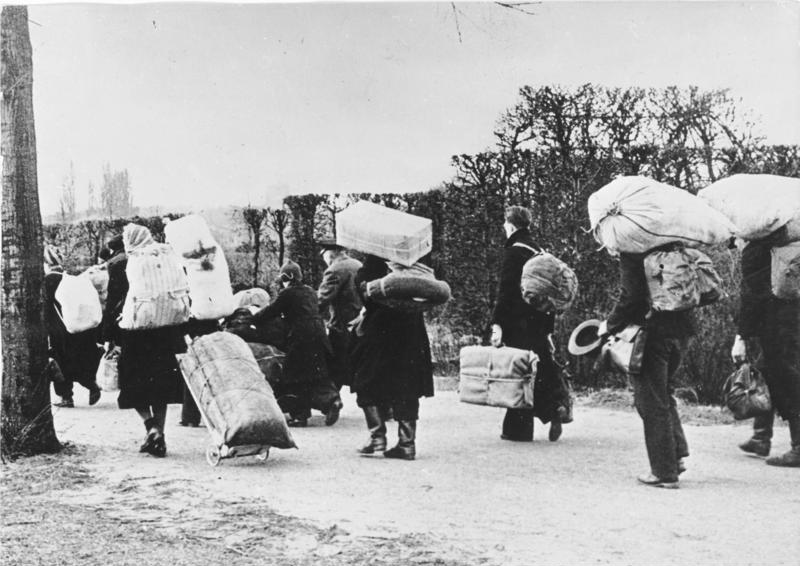
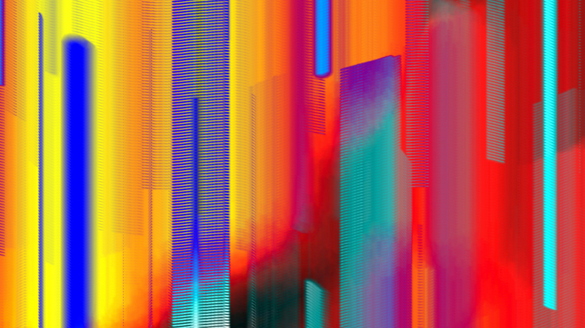
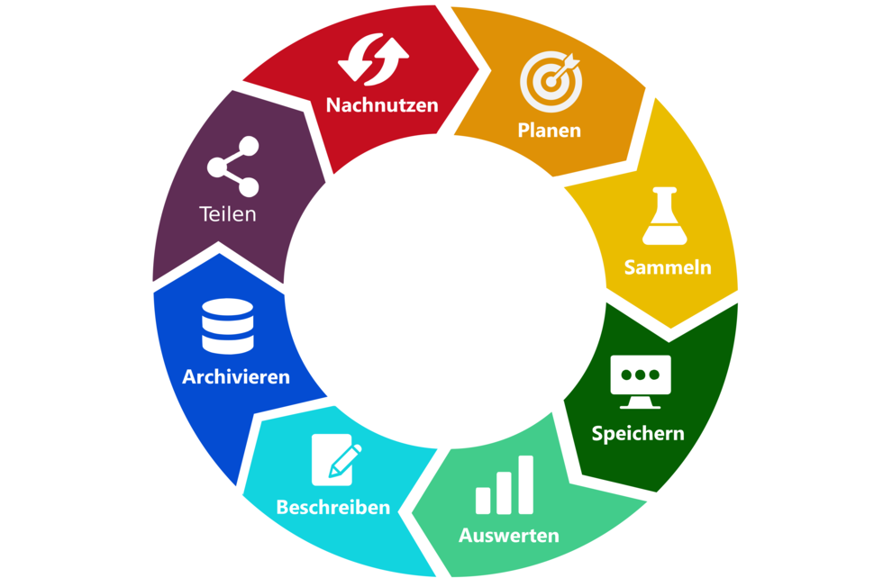
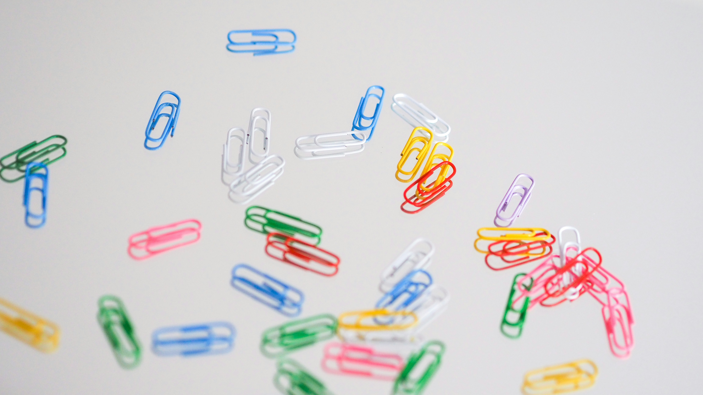

<!--
author:   Aina-Jula Stehr

email:    stu223341@mail.uni-kiel.de

version:  0.0.1

language: en

narrator: US English Female

-->

# Projekttitel


# Projektidee

Die begrenzte Verfügbarkeit von Quellen, bestehende Geschlechterstereotype, Vorurteile und fehlende "Role Models" sind nur einige der Herausforderungen, denen sich die Frauen- und Geschlechtergeschichte seit jeher stellen muss. In der Philosophie gibt es wiederum wenig(er) Aufmerksamkeit für Autorinnen:
Nach wie vor prägen Texte von Männern die Wahrnehmung des Faches, obwohl Frauen seit der Öffnung der Universitaten Anfang des 20. Jahrhunderts am akademischen Diskurs teilnehmen konnten und ein großer Textkorpus von Philosophinnen vorliegt. [Hier ein Beitrag dazu, wie Frauen das Schicksalsjahr 1939 durchlitten](https://www.morgenpost.de/kultur/article236611641/Wie-Frauen-das-Schicksalsjahr-1939-durchlitten.ht) Auch digitale Medien beeinflussen die Art und Weise, wie wir Geschichte erzählen, erleben, verbreiten und erarbeiten. Digitale Plattformen, Blogs, Foren und Social-Media-Kampagnen können ein neues Bewusstsein für geschlechtsspezifische Perspektiven schaffen und dazu beitragen, Veränderungen von Geschlechterrollen wahrzunehmen oder anzustoßen.

Studierenden wird mittels dieses Lehrprojekts die Möglichkeit geboten, sich forschungs- und quellenorientiert selbst ein Bild zu machen: 
Im Format von pro Semester je zwei Forschungswerkstätten wird dazu systematisch an Frauenbiographien und dem Werk von Frauen gearbeitet. 
Dabei kommen Methoden der Digital Humanities zum Einsatz, auch mit dem Ziel die Biographien einer größeren Öffentlichkeit zugänglich zu machen. Studierende erlernen so nicht nur wichtige Kompetenzen in der Arbeit mit Quellen und der Aufbereitung von Daten, sondern auch der Publikation und Wissenschaftskommunikation.

 Die in der Geschichte angesiedelten Projektseminare widmen sich verschiedenen Frauenbiografien der Frühen Neuzeit (SoSe 2025) und des 20. Jahrhunderts (WiSe 24/25 und SoSe 25). 
Denn auch noch in der Zeitgeschichte bleiben die Biografien vieler Frauen, bspw. von Wissenschaftlerinnen, vergleichsweise unsichtbar. Verantwortlich dafür war und ist die mangelnde Teilhabe vor Frauen an Wissenschaft und der wissenschaftlichen Geschichtsschreibung im Laufe des 19. Jahrhunderts, da ihnen schlichtweg der Zugang zu den Universitäten verwehrt blieb. Dies hatte zur Folge, dass die Themen von männlichen Handlungsräumen und Imaginationen beeinflusst wurden. 
Die Studieren gewinnen im Rahmen der Veranstaltungen einen Überblick über marginalisierte (d.h. im akademischen Diskurs weitestgehend unberücksichtigte) Forscherinnen. Es werden die wenigen Spuren in den Blick genommen, die trotzdem von Frauen hinterlassen wurden: Im Universitats- und Landesarchiv in Schleswig befinden sich Quellen, die bislang in Hinblick auf Frauen- und Geschlechterforschung noch nicht ausgewertet wurden.

 Die Seminare, die in der Philosophie angeboten werden, nehmen das Leben und Werk von Philosophinnen in den Blick, die aus Nazi-Deutschland fliehen mussten, und widmen sich dabei insbesondere dem Werk einer Auswahl von exilierten Philosophinnen, die bisher im akademischen Diskurs wenig Berücksichtigung gefunden haben. 


In den beiden forschungsorientierten Lehrveranstaltungen sammeln, strukturieren, interpretieren und veröffentlichen Studierende Informationen über Frauen, um Einblicke in soziale, familiäre und wissenschafliche Netzwerke von Frauen im 20. Jahrhundert zu erhalten. Umgesetzt werden die Lehrveranstaltungen im Format einer **digitalen Forschungswerkstatt**: 
Der Arbeitsablauf wird Schritt für Schritt entwickelt, umgesetzt und diskutiert. Durch die Forschungspraxis werden Studierende mit digitalen Kenntnissen gängigen Methoden für die (digitale) Bearbeitung und Auswertung von bspw. handschriftichen Quellen vertraut gemacht. Die Lehrveranstaltungen bilden so eine solide Grundlage für die kritische Anwendung solcher Verfahren im weiteren Studium, wie bspw. in Abschlussarbeiten, und in wissensvermittelnden Berufsfeldern. 

Die enge Kooperation zwischen Geschichte, Philosophie und Informatik, die in diesem Projekt angestrebt wird, soll u.a fachübergreifend nutzbare Lehrmaterialien und Open Educational Ressources hervorbringen. Ein Eindruck von einem Teil der bisherigen Ergebnisse kann in den Abschnitten zu den Projektseminaren gewonnen werden. 
Durch das gemeinsame Lehrprojekt und den engen Austausch wird außerdem angestrebt, den Studierenden Einblick in die Praxis interdisziplinärer, kollaborative Forschungsprojekte zu geben.


# Forschungsdatenmanagement

 Forschungsdatenmanagement (FDM) dient dazu, Forschungsdaten systematisch zu organisieren, zu speichern, zu dokumentieren und langfristig zugänglich zu machen. Es spielt eine entscheidende Rolle für die Qualität, Reproduzierbarkeit und Nachnutzung wissenschaftlicher Arbeiten.


## Was sind Daten in den digitalen Geisteswissenschaften?

In den digitalen Geisteswissenschaften (Digital Humanities) bezieht sich der Begriff "Daten" auf die digitalen Informationen, die als Grundlage für die Forschung, Analyse und Visualisierung genutzt werden. 
In der Geschichte und Philosophie können diese Daten aus einer Vielzahl von Quellen und Formaten stammen und ermöglichen es, neue Fragestellungen zu beantworten oder klassische Themen mit modernen digitalen Methoden zu untersuchen. 

Daten in diesem Kontext umfassen:

1. **Primärdaten**
- Texte: Digitalisierte Bücher, Manuskripte, Briefe, Zeitungsartikel, Theaterstücke und Gedichte, häufig in Form von Plain Text, XML (z. B. TEI-XML) oder anderen Formaten
- Bilder: Digitale Reproduktionen von Gemälden, Fotografien, Karten oder archäologischen Artefakten
- Audio- und Videodaten: Aufnahmen von Musik, Interviews, Reden oder Filmen
- Datenbanken: Historische, linguistische oder kulturelle Datenbanken (z. B. Stammbäume, Kataloge)

2. **Metadaten**
Metadaten sind Informationen, die die Primärdaten beschreiben oder strukturieren, z. B.:

- Titel, Autor, Veröffentlichungsdatum und -ort eines Werkes
- Geographische Koordinaten
- Kontextinformationen wie Entstehungszeit, Stil oder Genre

3. **Quantitative Daten**
- Statistische Erhebungen und numerische Daten
- Netzwerkanalysen (z. B. soziale Netzwerke zwischen historischen Figuren oder literarischen Charakteren)

4. **Geodaten**
Daten mit räumlichen Informationen, wie etwa GIS-Daten (Geoinformationssysteme) zur Kartierung historischer Orte und Ereignisse

5. **Digitale Annotationen**
Anmerkungen zu Texten oder Bildern, etwa linguistische Analysen (z. B. grammatische oder semantische Markierungen) oder kulturelle Kontexte

6. **Maschinell generierte Daten**
Ergebnisse von Text-Mining, Sentiment-Analysen, Topic Modeling oder Natural Language Processing (NLP), bei denen Algorithmen verwendet werden, um aus Texten oder Bildern neue Daten abzuleiten

## Linked Open Data


Linked Open Data (LOD) ist ein Konzept und eine Technologie, die darauf abzielt, Daten so zu veröffentlichen, dass sie im Internet miteinander verknüpft, maschinenlesbar und offen zugänglich sind. Es basiert auf den Prinzipien des Semantischen Webs und fördert die Nutzung von standardisierten Technologien, um die Interoperabilität von Daten über verschiedene Domänen hinweg zu ermöglichen.

**Vorteile von Linked Open Data**

- Interoperabilität: Unterschiedliche Datenquellen können integriert und gemeinsam genutzt werden. Zum Beispiel Historische Daten aus Archiven, die mit Daten aus Bibliotheken und Museen verknüpft werden, um ein umfassendes Bild von Ereignissen oder Personen zu schaffen.
- Maschinenlesbarkeit: Daten können von Algorithmen verarbeitet und analysiert werden, was Automatisierung und neue Forschung ermöglicht.
- Wissenserweiterung durch Verknüpfungen: Verlinkungen erlauben es, Beziehungen und Muster zwischen Daten sichtbar zu machen, die vorher unzugänglich waren.
- Offenheit und Nachnutzung: Durch offene Lizenzen können Daten frei genutzt, kombiniert und für neue Anwendungen aufbereitet werden.

**Kernprinzipien von Linked Open Data** (nach Tim Berners-Lee)

- Verwendung von URIs: Jede Ressource (z. B. ein Objekt, Konzept oder eine Person) erhält eine eindeutige Adresse im Web (Uniform Resource Identifier), damit sie identifiziert werden kann.
- HTTP-URIs: Die URIs sollten über das HTTP-Protokoll zugänglich sein, sodass sie leicht aufgerufen und genutzt werden können.
- Bereitstellung von maschinenlesbaren Daten: Die Informationen zu den Ressourcen sollen in standardisierten Formaten bereitgestellt werden, etwa RDF (Resource Description Framework) oder JSON-LD (JSON for Linked Data).
- Verknüpfung von Ressourcen: Daten sollten mit anderen Datenquellen verlinkt sein, um ein Netz von Informationen zu schaffen, das von Maschinen durchsucht und analysiert werden kann.
- Offenheit der Daten: Die Daten sollen frei zugänglich sein (unter einer offenen Lizenz wie CC BY), damit sie ohne Einschränkungen genutzt werden können.

**Wie funktioniert Linked Open Data?**

- Datenmodellierung mit RDF: Daten werden als "Triple" dargestellt: Subjekt - Prädikat - Objekt.

    Beispiel:
    ```html
    <http://dbpedia.org/resource/Berlin> <http://xmlns.com/foaf/0.1/name> "Berlin".
    ```
    Hier wird beschrieben, dass die Ressource "Berlin" einen Namen hat, der ebenfalls "Berlin" lautet.

- Ontologien und Vokabulare: Um Daten besser zu strukturieren und zu standardisieren, verwendet LOD Ontologien (z. B. FOAF, Dublin Core). Diese definieren, wie Konzepte und ihre Beziehungen beschrieben werden.
- Verlinkung mit anderen Datenquellen: Die Daten sind nicht isoliert, sondern mit anderen Datensätzen verknüpft, etwa zwischen DBpedia, Wikidata und spezialisierten Datenbanken (z. B. Europeana für kulturelles Erbe).


Beispiele für LOD Wissensdatenbanken:

- DBpedia: Eine strukturierte Datenbank, die Informationen aus Wikipedia extrahiert und miteinander verknüpft. Sie ermöglicht Anfragen in maschinenlesbarer Form.
- Wikidata: Eine zentrale Wissensdatenbank, die strukturierte und verknüpfte Daten über verschiedene Themen bereitstellt.
- Europeana: Eine digitale Plattform für das kulturelle Erbe Europas, die Linked Open Data nutzt, um Museen, Bibliotheken und Archive miteinander zu verbinden.
- Library of Congress: Verwendet Linked Open Data, um ihre Kataloge für maschinenlesbare Anfragen bereitzustellen

## Digitale Editionen



[LiaScript Kurs Digitale Editionswissenschaft](https://github.com/DH-Lehre/2023SoSe_Digitale-Editionswissenschaft)

## Metadatenmanagement 
- Deskriptive Metadaten
- Strukturelle Metadaten
- Administrative Metadaten
- Technische Metadaten

Metadatenstandards

Normdatenbanken
Beispiele:
 [Gemeinsame Normdatei (GND) der Deutschen Nationalbibliothek](https://www.dnb.de/DE/Professionell/Standardisierung/GND/gnd_node.html)

Creative Commons Lizenzen

## FAIR-Prinzipien


## Forschungsdatenzyklus 




# Methoden und Tools der digitalen Projektarbeit

## Planen 


[Checkliste Planung](https://www.static.tu.berlin/fileadmin/www/40000027/Dokumente/Checkliste_Planung_2023.pdf) der TU-Berlin

### Conceptboard

https://conceptboard.com/de/

## Sammeln 

Wo und wie recherchieren?

**Beispiele für Datensammlungen:**

- [Die Deutsche Digitale Bibliothek (DDB)](https://www.deutsche-digitale-bibliothek.de/)
- [Das Archivportal-D](https://www.archivportal-d.de/)
- [Das Zentrale Verzeichnis Digitalisierter Drucke (zvdd)](https://www.zvdd.de/startseite/)
- [Der Worldcat](https://search.worldcat.org/de)
- [Hathi Trust Digital Library](https://www.hathitrust.org/)
- [TextGrid repository](https://textgridrep.de/)
- [Generische Suche/DARIAH-DE](https://de.dariah.eu/generische-suche)
- [Bielefeld Academic Search Engine (BASE)](https://www.base-search.net/)
- [Deutsches Textarchiv (DTA)](https://www.deutschestextarchiv.de/)

**Datensammlungen, die sich insbesondere für die Erforschung von Frauenbiografien eignen:**

- [Digitales Deutsches Frauenarchiv](https://www.digitales-deutsches-frauenarchiv.de/)
- [META-Katalog](https://www.meta-katalog.eu/)
- [Bundeszentrale für politische Bildung](https://www.bpb.de/)
- [FemBio](https://www.fembio.org/)
- [Lebendiges Museum Online](https://www.dhm.de/lemo/)
- [Deutsche Biografie](https://www.deutsche-biographie.de/home)
- [Deutsche Nationalbibliothek](https://www.dnb.de/DE/Home/home_node.html)
- [History of Women Philosophers and Scientists](https://historyofwomenphilosophers.org/project/directory-of-women-philosophers/)
- [UeLex](https://uelex.de/)
- [Archiv der deutschen Frauenbewegung - Forschungsinstitut und Dokumentationszentrum](https://addf-kassel.de/)
- [FrauenMediaTurm](https://frauenmediaturm.de/)


**Speziell für die Forschung zu Philosophinnen im Exil:**

- [Leo Beck Institut](https://www.lbi.org/de/about/)
- [Das Jüdische Hamburg](https://www.dasjuedischehamburg.de/inhalt/das-juedische-hamburg)
- [Center for Jewish History](https://www.cjh.org/)
- [American Jewish Historical Society](https://ajhs.org/)
- [Digitales Archiv We Refugees Archive]()
- [Jewish Women's Archiv](https://jwa.org/)

### Umgang mit X-Technologien
XML, TEI, RDF

[LiaScript Kurs zum Umgang mit X-Technologien](in progress)

XML-Datenbanken 

### SPARQL-Suchabfragen

### Arcinsys

[LiaScript Kurs zur Einführung in die Arbeit mit Arcinsys](https://github.com/DH-Lehre/arcinsys-workflow)

## Speichern 

[Checkliste Speicherung](https://www.static.tu.berlin/fileadmin/www/40000027/Dokumente/Checkliste_Speicherung_2023.pdf) der TU-Berlin

Textdigitalisierung

### Scan Tent und Transkribus

[LiaScript Kurs zur Einführung in die Arbeit mit Transkribus](https://github.com/DH-Lehre/transkribus-workflow)

## Auswerten 
### Named Entity Recognition (Stanford-NER)?
### N-Gram Viewer
### Voyant

Distant Reading als Methode

[Voyant als "Distant Reading"-Tool](https://github.com/DH-Lehre/WiSe2023_Seminar-Heinrich-Bluechers-Nachlass/blob/main/main.md)

### Netzwerkanalyse mit Gephi?

## Beschreiben

[Checkliste Beschreibung](https://www.static.tu.berlin/fileadmin/www/40000027/Dokumente/Checkliste_Beschreibung_2023.pdf) der TU-Berlin

### Textvisualisierung mit Storymaps 

Verschiedene Visualisierungsmöglichkeiten

### GIS und digitale Karten


### Kollaborative Annotation mit CATMA?

### TEI Publisher

Deep Reading als Methode

Digitale Annotation



[TEI Publisher als "Deep Reading"-Tool](https://github.com/DH-Lehre/WiSe2023_Seminar-Heinrich-Bluechers-Nachlass/blob/main/main.md)

## Archivieren 

[Checkliste Archivierung](https://www.static.tu.berlin/fileadmin/www/40000027/Dokumente/Checkliste_Archivierung_2023.pdf) der TU-Berlin 

### Omeka S

[LiaScript Kurs zur Einführung in die Arbeit mit OmekaS](https://github.com/DH-Lehre/Omeka-S-Workflow)

## Teilen 

[Checkliste Veröffentlichung](https://www.static.tu.berlin/fileadmin/www/40000027/Dokumente/Checkliste_Veroeffentlichung_2023.pdf) der TU-Berlin 

### Git und Git Hub

## Nachnutzen 

[Checkliste Nachnutzung](https://www.static.tu.berlin/fileadmin/www/40000027/Dokumente/Checkliste_Nachnutzug_2023.pdf) der TU-Berlin 

### LiaScript

https://liascript.github.io/

[LiaScript workflow](https://github.com/DH-Lehre/liascript-workflow/blob/vorl%C3%A4ufige-%C3%84nderungen-branch/workshop.md)

### Podcasts 

[LiaScript Kurs Podcast-Leitfaden](https://github.com/DH-Lehre/Podcast-Leitfaden)

# Projektseminare

Überblick

## Frauengeschichte(n) 

### SoSe 25: Frauengeschichte(n) ...

[LiaScript Kurs Frauengeschichte(n) ...](link folgt)

### WiSe 24/25: Frauengeschichte(n) im 20. Jahrhundert

[LiaScript Kurs Frauengeschichte(n) im 20. Jahrhundert](https://github.com/DH-Lehre/2024WiSe_Exil-Wissenschaftlerinnen)

### SoSe 24: Frauengeschichte(n) in der frühen Neuzeit

[LiaScript Kurs Frauengeschichte(n) in der frühen Neuzeit](https://github.com/DH-Lehre/2024SoSe_Seminar-Frauengeschichte-Fruehe-Neuzeit)

## Philosophinnen im Exil
Übersicht

### Seminar SoSe 25

[LiaScript Kurs Philosophinnen im Exil SoSe 25](link folgt)

### Seminar WiSe 24/25

[LiaScript Kurs Philosophinnen im Exil WiSe 24/25](https://github.com/DH-Lehre/2024WiSe_Exil-Philosophinnen_II)

### Seminar SoSe 24

[LiaScript Kurs Philosophinnen im Exil SoSe 24](https://github.com/DH-Lehre/2024SoSe_Seminar-Philosophinnen-im-Exil)